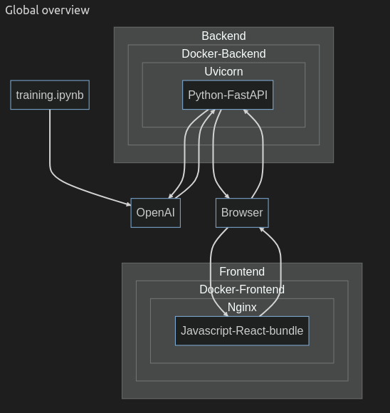
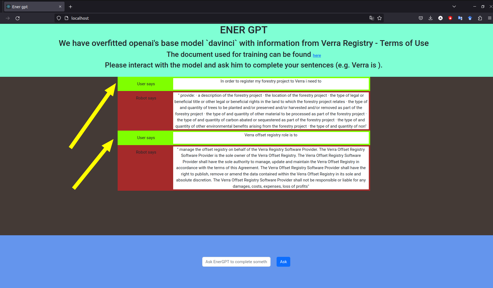

## Custom OpenAI model

Overview

-   Idea generation
-   Data preparation
-   OpenAI training
-   Backend development
-   Frontend development
-   Infrastructure development
-   Report files:
    -   mermaid diagram
    -   demo screenshot

---

## Idea

Our core idea was to build a language model that would help the people navigate the carbon markets.

Verra registry is a private entity that guarantees for the projects' quality/ ability to combat pollution.

---

## System overview



---

## Train

### Data preparation (`.jsonl` dataset)

We have chosen one pdf from Verra. Verra terms of registry on verra.org:

-   `verra.pdf` (https://verra.org/wp-content/uploads/Verra-Registry-TOU-September-2021_FINAL-1.pdf)

We automatically transformed it into a .txt file through some random online tool:

-   `verra.txt`

We used the OpenAI cli for preparing data:

```
$ openai tools fine_tunes.prepare_data -f verra.txt
```

This generated us the final dataset (which is a bit rough):

-   `verra.jsonl`

---

### OpenAI interaction

For complete information look into `train.ipynb` file.

---

## Demo

### Fill in your own credentials in `backend.env`

```
openai_api_key=TODO
openai_model_id=TODO
```

### Start the system over docker-compose

```
./start.sh
```

### Go to browser on `http://localhost`



---
