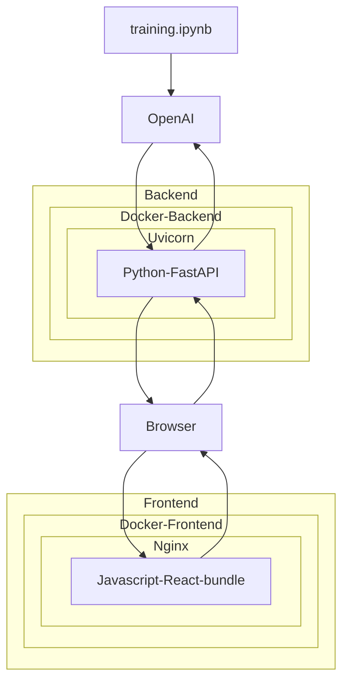

### Global overview

```mermaid
graph TD;
    training.ipynb-->OpenAI;

    Browser-->Javascript-React-bundle;
    Javascript-React-bundle-->Browser;

    Browser-->Python-FastAPI;
    Python-FastAPI-->Browser;

    Python-FastAPI-->OpenAI;
    OpenAI-->Python-FastAPI;

    subgraph Frontend
        subgraph Docker-Frontend
            subgraph Nginx
                Javascript-React-bundle
            end
        end
    end

    subgraph Backend
        subgraph Docker-Backend
            subgraph Uvicorn
                Python-FastAPI
            end
        end
    end
```
